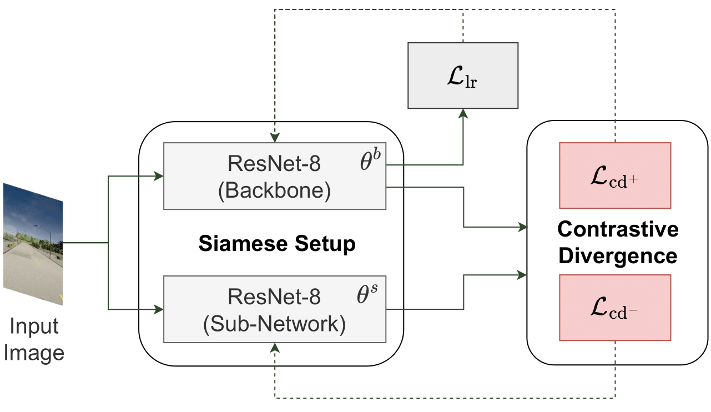

# Reducing Non-IID Effects in Federated Autonomous Driving with Contrastive Divergence Loss

*Federated learning has been widely applied in autonomous driving since it enables training a learning model among vehicles without sharing users' data. However, data from autonomous vehicles usually suffer from the non-independent-and-identically-distributed (non-IID) problem, which may cause negative effects on the convergence of the learning process. In this paper, we propose a new contrastive divergence loss to address the non-IID problem in autonomous driving by reducing the impact of divergence factors from transmitted models during the local learning process of each silo. We also analyze the effects of contrastive divergence in various autonomous driving scenarios, under multiple network infrastructures, and with different centralized/distributed learning schemes. Our intensive experiments on three datasets demonstrate that our proposed contrastive divergence loss significantly improves the performance over current state-of-the-art approaches.*


*<center>**Figure 1**: The Siamese setup when our CDL is applied for training federated autonomous driving mode.</center>*

This repository is the implementation of **Reducing Non-IID Effects in Federated Autonomous Driving with Contrastive Divergence Loss**. We benchmark our method on three public datasets: Udacity+ (A non-IID version of [Udacity](https://www.udacity.com/self-driving-car)), Carla, and Gazebo.

For the detail, please refer to [link](https://arxiv.org/pdf/2303.06305.pdf).

This repository is based on and inspired by @Binh X. Nguyen [work](https://github.com/aioz-ai/FADNet). We sincerely thank for their sharing of the codes.

## Summary

* [Prerequisites](#prerequisites)
* [Datasets](#datasets)
* [Networks](#networks)
* [Training](#training)
* [Pretrained models and Testing](#pretrained-models-and-testing)
* [Citation](#citation)
* [License](#license)
* [More information](#more-information)

### Prerequisites

PYTHON 3.6

CUDA 9.2

Please install dependence package by run following command:
```
pip install -r requirements.txt
```

### Datasets

* For UDACITY+ dataset, we provide:
    * The split train/test dataset for GAIA network at [link](https://vision.aioz.io/f/aa717ba5c0cd4b06975e/?dl=1). You can download and extract them into "data/driving_udacity/" folder.

* For GAZEBO dataset, we provide:
    * The original dataset and the split train/test dataset for GAIA network at [link](https://vision.aioz.io/f/79afffd7fc444ba9ba0d/?dl=1). You can download and extract them into "data/driving_gazebo/" folder.

* For CARLA dataset, we provide:
    * The original dataset and the split train/test dataset for GAIA network at [link](https://vision.aioz.io/f/9091c519b3904a4695ab/?dl=1). You can download and extract them into "data/driving_carla/" folder.

### Networks

Important: Before running any command lines in this section, please run following command to access 'graph_utils' folder:
```
cd graph_utils
```
And now, you are in 'graph_utils' folder.

Please download graph data at [link](https://github.com/omarfoq/communication-in-cross-silo-fl/tree/main/graph_utils/data) and put into `data` folder.

* To generate networks for UDACITY+ dataset and compute the cycle time for them:
    ```
    bash generate_network_driving-udacity.sh
    ```

* To generate networks for GAZEBO dataset and compute the cycle time for them:
    ```
    bash generate_network_driving-gazebo.sh
    ```

* To generate networks for CARLA dataset and compute the cycle time for them:
    ```
    bash generate_network_driving-carla.sh
    ```

### Training

* To train our method on UDACITY+ dataset with GAIA network, run:

```
bash train_udacity_gaia.sh
```

* To train our method on CARLA/GAZEBO dataset with GAIA network, you can use the same setup on UDACITY+.

### Pretrained models and Testing

We provide the pretrained models which are trained on UDACITY+ dataset with GAIA network by our method at the last epoch. Please download at [link](https://vision.aioz.io/f/e97c08a4c3014e52a478/?dl=1) and extracted them into the "pretrained_models/DRIVING-UDACITY_GAIA/" folder.

The models can be evaluated in UDACITY+ train and test set via:
```
bash test_udacity_gaia.sh
```

### Citation

If you use this code as part of any published research, we'd really appreciate it if you could cite the following paper:

```
@inproceedings{do2024reducing,
  title={Reducing Non-IID Effects in Federated Autonomous Driving with Contrastive Divergence Loss},
  author={Do, Tuong and Nguyen, Binh X and Tran, Quang D and Nguyen, Hien and Tjiputra, Erman and Chiu, Te-Chuan and Nguyen, Anh},
  booktitle={2024 IEEE International Conference on Robotics and Automation (ICRA)},
  pages={2190--2196},
  year={2024},
  organization={IEEE}
}
```

```
@inproceedings{nguyen2022_DFL,
  title={Deep Federated Learning for Autonomous Driving},
  author={Nguyen, Anh and Do, Tuong and Tran, Minh and Nguyen, Binh X and Duong, Chien and Phan, Tu and Tjiputra, Erman and Tran, Quang D},
  booktitle={33rd IEEE Intelligent Vehicles Symposium},
  year={2022}
}
```

### License

MIT License

### More information
AIOZ AI Homepage: https://ai.aioz.io
